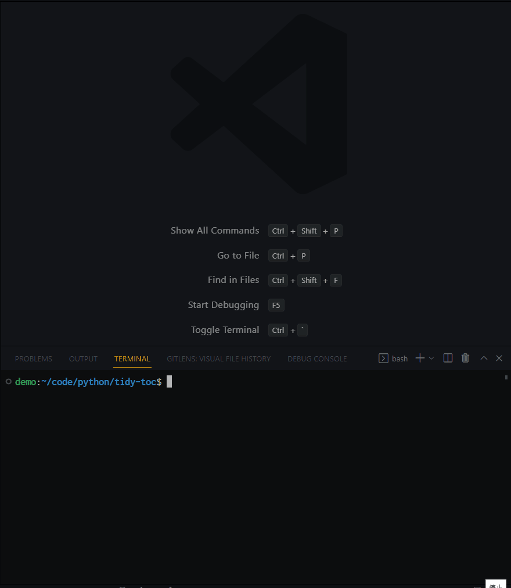
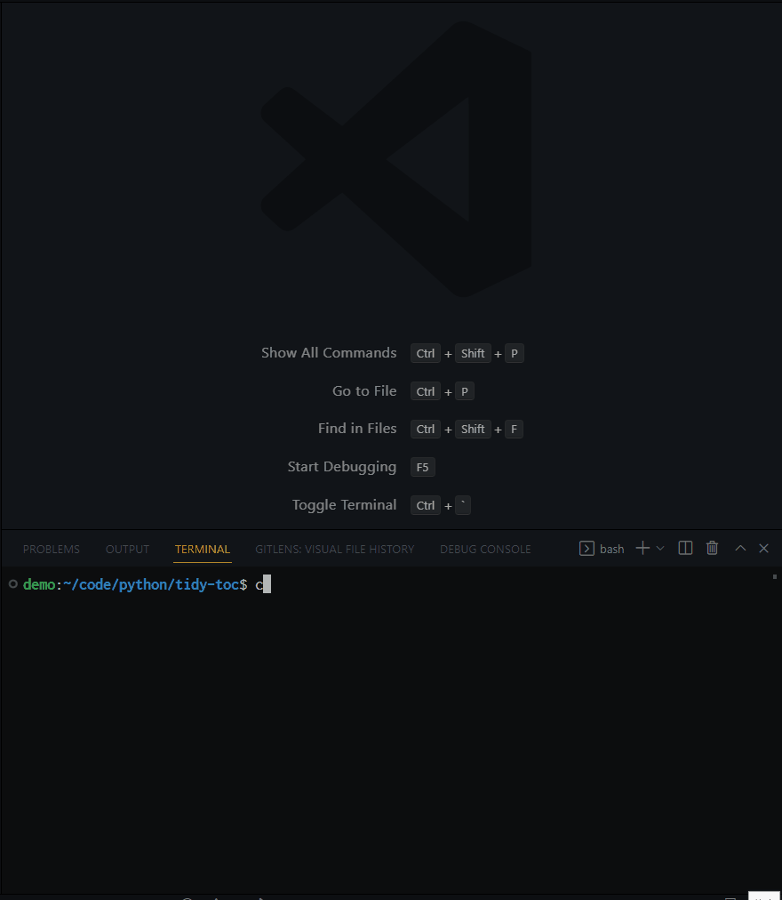

# Command line tool to clean OCRed ToC text

- [Command line tool to clean OCRed ToC text](#command-line-tool-to-clean-ocred-toc-text)
    - [About](#about)
    - [Demo](#demo)
    - [Install](#install)
    - [Usage](#usage)

## About

A command line tool to clean text data derived by OCRing a table of contents (typically of a book).
It removes meaningless strings that are output by OCR engine such as

```txt
# example of meaningless strings
Introduction ......... 00... eeeeeeee 1
....
Matrices and Maps............. 060 cece eee cece eee te nee eee 328
```

and detects strange rows and interactively removes them.

```txt
Banach Spaces
§1. Elementary Properties and Examples 63
§2. Linear Operators on Normed Spaces 67
xiv Contents <- strange !
§3. Finite Dimensional Normed Spaces 69
§4. Quotients and Products of Normed Spaces 70
```

It also finds and interactively removes unwanted new lines such as

```txt
7.5.2 Approximating the Power Function and the Expected Sample
Size 334
```

Moreover, it points out and interactively fix rows having problematic page number such as

```txt
Exercises 37
Chapter 2 <-
Utility and Loss 40
2.1 Introduction 39 <-
```

## Demo

The first demo shows how the process of interactive cleaning of unwanted characters and rows goes.
The input and output text file are at [sample (clean & select)](/sample/sample_clean_select.txt) and at [output sample (clean & select)](/sample/sample_clean_select_cleaned.txt).



The second demo shows the process of merging rows and correcting page numbers.



The sample ToCs used here are OCRed (by tesseract) table of contents of books [Monte Carlo Statistical Methods](https://link.springer.com/book/10.1007/978-1-4757-4145-2) and [Statistical Decision Theory](https://link.springer.com/book/10.1007/978-1-4757-1727-3), respectively.

## Install

- Tested Environment
  - Windows 10 + WSL2 + Ubuntu 20.04
  - python 3.10.5 (pyenv 2.3.2) + poetry (1.1.11)

Follow a typical routine of setting up a virtual environment by pyenv + poetry.

```bash
git clone https://github.com/Shena4746/tidy-toc.git
cd ./tidy-toc
pyenv local 3.10.5
```

The last line fails if you have not downloaded python 3.10.5. Run the following to download it, and try the previous pyenv command again.

```bash
pyenv install 3.10.5
```

Locate the python interpreter at {project-top}/.venv. Then let poetry perform a local installation of dependency.

```bash
python3 -m venv .venv
poetry install
```

Make sure that poetry uses the intended python interpreter.

```bash
poetry run which python
poetry run python --version
```

## Usage

The following command shows help.

```bash
/path/to/{project-top}/.venv/bin/python3 /path/to/tidy-toc.py --help

# Usage: tidy-toc.py [OPTIONS] TEXT_FILE

#   clean OCRed ToC text data.

# Options:
#   -c, --clean             remove useless characters such as the long series of
#                           periods between text and page number, e.g.,
#                           'Introduction [.........,..,,.,..] 1'
#   -s, --select            suggest unnecessary rows, such as 'xii', 'iv
#                           Contents', and ask user to select from them
#                           interactively.
#   -m, --merge             suggest neighboring two rows that might be
#                           originally in a same row, such as '1.1 hello'
#                           followed by 'world 5.'
#   -p, --page              point out badly page-numbered rows and correct them
#                           interactively.
#   -l, --maxline INTEGER   the number of suggested rows displayed at once in
#                           the --select process. the default uses 10. will be
#                           ignored unless --select option is enabled.
#   -d, --dirout DIRECTORY  directory where output text file is saved. the
#                           default uses the same place as the input text file.
#   --pre TEXT              prefix for the stem-name of the output text file.
#                           the default is ''. see --join option.
#   --suf TEXT              suffix for the stem-name of the output text file.
#                           the default is '_cleaned'. see --join option.
#   -j, --join TEXT         the character with which prefix + (text file name) +
#                           suffix are combined. e.g., prefix='pre', text file
#                           name='sample.txt', suffix='suf', join='_' -> output
#                           text file name='pre_sample_suf.txt'
#   -o, --overwrite         overwrite input file with output. If enabled, all
#                           options for output file name such as --pre and
#                           --join are ignored.
#   --help                  Show this message and exit.
```

As in [Demo](#demo), it is often convenient to set an alias for the `/path/to/interpreter /path/to/tidy-toc.py`.
