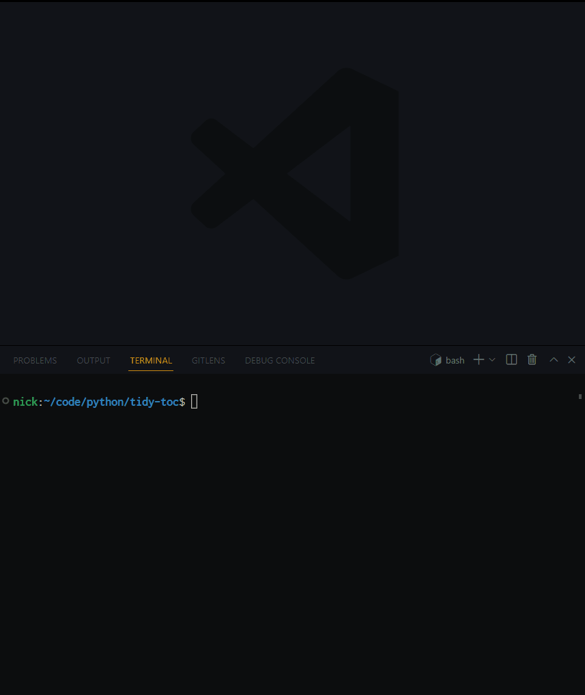

# Command line tool to clean OCRed ToC text

- [Command line tool to clean OCRed ToC text](#command-line-tool-to-clean-ocred-toc-text)
    - [About](#about)
    - [Demo](#demo)
    - [Install](#install)
    - [Usage](#usage)

## About

A command line tool to clean text data derived by OCRing a table of contents (typically of a book).
It removes meaningless strings that are output by OCR engine such as

- Examples of meaningless strings
  - Introduction <u>......... 00... eeeeeeee</u> 1
  - ......
  - Matrices and Maps<u>............. 060 cece eee cece eee te nee eee</u> 328

It also detects strange rows and interactively asks user if each of them should be removed.
The most typical example of such strange row is

```txt
Banach Spaces
§1. Elementary Properties and Examples 63
§2. Linear Operators on Normed Spaces 67
xiv Contents <- THIS!
§3. Finite Dimensional Normed Spaces 69
§4. Quotients and Products of Normed Spaces 70
```

## Demo

Watch the demo gif. The text file used here is an OCRed (by tesseract) table of contents of a book [Monte Carlo Statistical Methods](https://link.springer.com/book/10.1007/978-1-4757-4145-2).
The input text file is at [input sample](/sample/table_of_contents_OCRed.txt) and the output is at [output sample](/sample/table_of_contents_OCRed_cleaned.txt).
It shows you

- how dirt the sample file is
- how the process of interactive cleaning goes
- how much the output text file has been improved



## Install

- Tested Environment
  - Windows 10 + WSL2 + Ubuntu 20.04
  - python 3.10.5 (pyenv 2.3.2) + poetry (1.1.11)

Follow a typical routine of setting up a virtual environment by pyenv + poetry.

Copy this project in some way, for instance, by git clone or create a repository from this template project.

```bash
git clone https://github.com/Shena4746/tidy-toc.git
cd ./tidy-toc
```

Enable python 3.10.5 at the top of the project directory. We do it simply by pyenv here.

```bash
pyenv local 3.10.5
```

It fails if you have not downloaded python 3.10.5. Run the following to download it, and try the previous command again.

```bash
pyenv install 3.10.5
```

Locate the python interpreter at {project-top}/.venv. Then let poetry perform a local installation of dependency.

```bash
python3 -m venv .venv
poetry install
```

Make sure that poetry uses the intended python interpreter.

```bash
poetry run which python
poetry run python --version
```

## Usage

The following command shows help.

```bash
/path/to/{project-top}/.venv/bin/python3 /path/to/tidy-toc.py --help

# Usage: tidy-toc.py [OPTIONS] TEXT_FILE

#   clean OCRed ToC text data.

# Options:
#   -c, --clean             remove useless characters such as the long series of
#                           periods between text and page number, e.g.,
#                           'Introduction [.........,..,,.,..] 1'
#   -s, --select            suggest unnecessary lines, such as such as 'xii',
#                           'iv Contents', and ask user to select from them
#                           interactively.
#   -m, --maxline INTEGER   the number of suggested lines displayed at once in
#                           the --select process. the default uses 10. ignored
#                           unless --select option is enabled.
#   -d, --dirout DIRECTORY  directory where output text file is saved. the
#                           default uses the same place as the input text file.
#   --pre TEXT              prefix for the stem-name of the output text file.
#                           the default is ''. see --join option.
#   --suf TEXT              suffix for the stem-name of the output text file.
#                           the default is '_cleaned'. see --join option.
#   -j, --join TEXT         the character with which prefix + (text file name) +
#                           suffix are combined. e.g., prefix='pre', text file
#                           name='sample.txt', suffix='suf', join='_' -> output
#                           text file name='pre_sample_suf.txt'
#   --help                  Show this message and exit.
```

As in [Demo](#demo), it is often convenient to set an alias for the `/path/to/interpreter /path/to/tidy-toc.py`.
